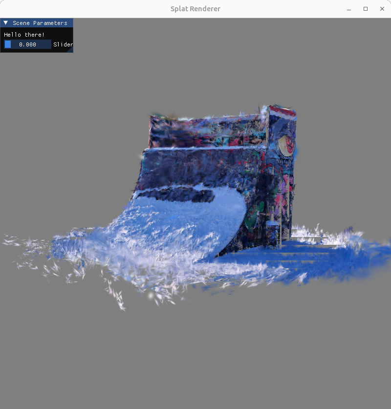

## About

A toy project for rendering gaussian splats with OpenGL.

Work in progress 🔨

## TODO

- Optimize for real-time viewing by
    - Sorting the gaussians on GPU
    - More accurate bounding boxes for gaussians
    - Persistent CPU <--> GPU buffer mapping

- Fix graphical bugs related to
    - Insufficient memory in the pixel rendering part
    

## Credits

### Libraries

- [GLFW](https://www.glfw.org/)  - zlib/libpng license
- [GLAD](https://github.com/Dav1dde/glad) - MIT license
- [GLM](https://github.com/g-truc/glm) - MIT license
- [Dear ImGui](https://github.com/ocornut/imgui) - MIT license
- [STB Image](https://github.com/nothings/stb) - MIT license
- [miniply](https://github.com/vilya/miniply) - MIT license

### Tools

- [vcpkg](https://github.com/microsoft/vcpkg) - MIT license

### Other

- [LearnOpenGL](https://learnopengl.com/)
    - Shader and Camera classes
    - OpenGL basics

## License

The code in this repository is licensed under the MIT License.
